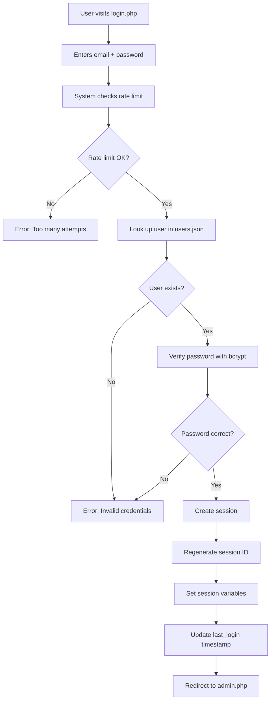

# Live Situation Room - Multi-Tenant SaaS Platform

**A production-ready, real-time collaborative workshop platform with integrated payment processing, multi-tenant architecture, and enterprise-grade security.**

[](https://php.net)
[](LICENSE)
[](TESTING_SUMMARY.md)

---

## 🎯 Executive Summary

Live Situation Room is a sophisticated **multi-tenant SaaS application** designed for real-time collaborative workshops, brainstorming sessions, and interactive ideation events. Built with a unique **zero-database architecture**, it uses atomic file operations to achieve ACID properties without traditional database infrastructure—while supporting multiple independent workshops across different user accounts.

### Core Value Proposition

- **🚀 Multi-Tenant SaaS**: Complete user registration, authentication, and subscription management
- **💳 Integrated Payments**: Stripe-powered subscription system (Free/Premium/Enterprise)
- **🏢 Zero Infrastructure**: No database, Redis, or message queue required
- **⚡ Production-Tested**: Validated with 50+ concurrent users per workshop
- **📱 Mobile-First**: Optimized participant experience on smartphones
- **🔒 Enterprise Security**: CSP headers, rate limiting, XSS protection, secure sessions
- **🎯 Self-Contained**: Single directory deployment with atomic file operations
- **👥 User Isolation**: Complete data separation per user account

---

## 📋 Table of Contents

- [Key Features](#-key-features)
- [Architecture Overview](#-architecture-overview)
- [Multi-Tenant Design](#-multi-tenant-design)
- [Subscription Plans](#-subscription-plans--pricing)
- [Security Features](#-security-features)
- [Installation](#-installation--deployment)
- [Configuration](#-configuration)
- [User Guide](#-user-guide)
- [API Documentation](#-api-documentation)
- [Technical Details](#-technical-details)
- [Development](#-development)
- [Troubleshooting](#-troubleshooting)

---

## ✨ Key Features

### 🏢 Multi-Tenant SaaS Platform

#### **User Management System**
- ✅ **User Registration** - Email-based account creation with password hashing (bcrypt)
- ✅ **Authentication** - Secure login with session management and rate limiting
- ✅ **Password Reset** - Token-based password recovery system
- ✅ **User Dashboard** - Personalized admin panel per user
- ✅ **Data Isolation** - Complete separation of workshop data between users
- ✅ **Public URLs** - Each user gets shareable workshop links (`index.php?u={user_id}`)

#### **Subscription Management**
- ✅ **Three-Tier Pricing** - Free, Premium (€19.99/mo), Enterprise (custom)
- ✅ **Stripe Integration** - Secure payment processing with zero-dependency API client
- ✅ **Feature Limits** - Enforced participant/column/workshop quotas per plan
- ✅ **Subscription Dashboard** - Users can view, upgrade, cancel subscriptions
- ✅ **Webhook Handling** - Automatic subscription updates via Stripe webhooks
- ✅ **Billing Portal** - Direct integration with Stripe Customer Portal

### 📊 Live Workshop Dashboard (`index.php`)

**For Workshop Participants:**
- Real-time display updates (2-second polling)
- Categorized idea columns with custom icons
- Focus spotlight mode for highlighted entries
- QR code for instant mobile access
- Light/dark theme toggle
- Public access via shareable URL

**For Workshop Owners:**
- Admin context menu (right-click on entries)
- Quick visibility toggles
- Live moderation controls
- PDF export functionality
- Customizable branding (logo, title)

### 📝 Public Submission Form (`eingabe.php`)

- Dynamic category selection from owner's configuration
- Guiding questions (Leitfragen) per category
- 500-character limit with live counter
- Rate limiting (10 submissions/min per IP)
- Success confirmation with emoji feedback
- Mobile-optimized input experience
- Works without user account (public access)

### 🎛️ Admin Moderation Panel (`admin.php`)

**Authentication-Protected Dashboard:**
- Real-time feed of all submissions
- Mass control operations (show/hide all, by category)
- Individual entry moderation (show/hide, focus, edit, delete)
- Category reassignment (move entries between columns)
- Live text editing with save/cancel
- PDF export for documentation
- Workshop URL sharing (copy-to-clipboard)
- Subscription status display
- Quick navigation to customization

### ⚙️ Workshop Customization (`customize.php`)

**Full Configuration Control:**
- Workshop title with HTML support (`<br>` for line breaks)
- Logo URL configuration with validation
- Category management (add/edit/remove unlimited categories)
- Per-category settings:
  - Unique key (lowercase identifier)
  - Display name
  - 3-letter abbreviation
  - Icon (emoji)
  - Guiding questions (Leitfragen)
- Live configuration preview
- Auto-save with backup creation

### 💳 Subscription Management (`subscription_manage.php`)

**User Subscription Dashboard:**
- Current plan display (Free/Premium/Enterprise)
- Feature usage vs. limits
- Subscription status (active/cancelled/past_due)
- Billing period information
- Quick actions:
  - Upgrade to Premium (monthly/yearly)
  - Cancel subscription (downgrade to Free)
  - Reactivate cancelled subscription
  - Access Stripe Billing Portal
- Payment history link

### 🔐 Security & Authentication

**Enterprise-Grade Security:**
- **Security Headers**: CSP, HSTS, X-Frame-Options, X-XSS-Protection
- **Session Security**: HttpOnly cookies, SameSite=Strict, 2-hour timeout
- **Password Security**: bcrypt hashing (cost 10), 8-char minimum
- **Rate Limiting**: Login attempts, public submissions, API calls
- **CSRF Protection**: Tokens on all POST forms
- **XSS Prevention**: HTML sanitization on all outputs
- **Input Validation**: Email format, URL safety, path traversal prevention
- **SSL/TLS**: Certificate verification on Stripe API calls
- **Webhook Verification**: HMAC-SHA256 signature validation

---

## 🏗️ Architecture Overview

### System Architecture

Live Situation Room implements a **multi-tenant file-based transactional system** with complete user isolation:

```
┌─────────────────────────────────────────────────────────────┐
│                    APPLICATION LAYER                         │
│  ┌─────────────┐  ┌──────────────┐  ┌─────────────────┐   │
│  │  Public UI  │  │  Admin Panel │  │  Subscription   │   │
│  │             │  │              │  │  Management     │   │
│  │ index.php   │  │  admin.php   │  │                 │   │
│  │ eingabe.php │  │ customize.php│  │ checkout.php    │   │
│  └─────────────┘  └──────────────┘  └─────────────────┘   │
└─────────────────────────────────────────────────────────────┘
                           ↓
┌─────────────────────────────────────────────────────────────┐
│                    BUSINESS LOGIC LAYER                      │
│  ┌──────────────────┐  ┌────────────────────────────────┐  │
│  │  User Auth       │  │  Subscription Manager          │  │
│  │  user_auth.php   │  │  subscription_manager.php      │  │
│  │                  │  │  stripe_api_client.php         │  │
│  │  - Registration  │  │                                │  │
│  │  - Login/Logout  │  │  - Plan limits enforcement     │  │
│  │  - Password Reset│  │  - Stripe checkout             │  │
│  │  - Sessions      │  │  - Webhook handling            │  │
│  └──────────────────┘  └────────────────────────────────┘  │
│                                                               │
│  ┌──────────────────┐  ┌────────────────────────────────┐  │
│  │  File Handling   │  │  Security Helpers              │  │
│  │  file_handling   │  │  security_helpers.php          │  │
│  │  _robust.php     │  │                                │  │
│  │                  │  │  - Header setting              │  │
│  │  - Atomic ops    │  │  - XSS prevention              │  │
│  │  - Auto backups  │  │  - Rate limiting               │  │
│  │  - Locking       │  │  - Input validation            │  │
│  └──────────────────┘  └────────────────────────────────┘  │
└─────────────────────────────────────────────────────────────┘
                           ↓
┌─────────────────────────────────────────────────────────────┐
│                    DATA PERSISTENCE LAYER                    │
│                                                               │
│  users.json                    # Global user registry        │
│  password_reset_tokens.json    # Password reset tokens       │
│  pricing_config.json            # Subscription plans         │
│  public_rate_limits.json        # Submission throttling      │
│                                                               │
│  data/                          # Multi-tenant data store    │
│  ├── user_abc123/               # User 1's workspace         │
│  │   ├── daten.json              # Workshop submissions      │
│  │   ├── config.json             # Workshop configuration    │
│  │   └── backups/                # Auto-backups             │
│  │       └── daten_backup_*.json                            │
│  │                                                            │
│  ├── user_def456/               # User 2's workspace         │
│  │   ├── daten.json                                          │
│  │   ├── config.json                                         │
│  │   └── backups/                                            │
│  │                                                            │
│  └── ...                         # Additional user workspaces│
│                                                               │
└─────────────────────────────────────────────────────────────┘
                           ↓
┌─────────────────────────────────────────────────────────────┐
│                    EXTERNAL INTEGRATIONS                     │
│                                                               │
│  Stripe API (api.stripe.com)                                │
│  ├── Checkout Sessions                                       │
│  ├── Subscription Management                                 │
│  ├── Webhook Events                                          │
│  └── Customer Portal                                         │
│                                                               │
└─────────────────────────────────────────────────────────────┘
```

### Technical Stack

| Layer | Technology | Version | Purpose |
|-------|------------|---------|---------|
| **Server Runtime** | PHP | 7.4+ | Server-side execution engine |
| **Data Persistence** | JSON Files | Native | Structured data storage (no database) |
| **Concurrency Control** | PHP `flock()` | Native POSIX | File locking for atomicity |
| **Authentication** | PHP Sessions | Native | Secure session management |
| **Payments** | Stripe API | v2024-12-18 | Subscription processing |
| **Frontend** | Vanilla JavaScript | ES6+ | DOM manipulation, real-time updates |
| **Styling** | CSS3 + Variables | Standard | Responsive theming system |
| **Typography** | Google Fonts | CDN | Montserrat, Roboto |
| **QR Codes** | QRCode.js | 1.0.0 | Mobile access generation |

---

## 🏢 Multi-Tenant Design

### User Isolation Architecture

Each user account operates in **complete isolation** with dedicated file storage:

```
data/
├── {user_id_1}/
│   ├── daten.json           # User 1's workshop submissions
│   ├── config.json          # User 1's workshop configuration
│   └── backups/             # User 1's automatic backups
│       ├── daten_backup_2026-01-12_10-30-45.json
│       └── ...
│
├── {user_id_2}/
│   ├── daten.json           # User 2's workshop submissions
│   ├── config.json          # User 2's workshop configuration
│   └── backups/
│
└── {user_id_N}/
    ├── daten.json
    ├── config.json
    └── backups/
```

### Access Control Model

| Resource | Public Access | Authenticated Owner | Other Users |
|----------|---------------|---------------------|-------------|
| **View Workshop** (`index.php?u={id}`) | ✅ Read-Only | ✅ Read + Context Menu | ✅ Read-Only |
| **Submit Ideas** (`eingabe.php?u={id}`) | ✅ Public Form | ✅ Public Form | ✅ Public Form |
| **Admin Panel** (`admin.php`) | ❌ Redirect to Login | ✅ Full Control | ❌ Access Denied |
| **Customize** (`customize.php`) | ❌ Redirect to Login | ✅ Full Control | ❌ Access Denied |
| **Subscription** (`subscription_manage.php`) | ❌ Redirect to Login | ✅ Own Subscription | ❌ Access Denied |

### User Registration Flow

```mermaid
graph TD
    A[User visits welcome.php] --> B[Clicks 'Register']
    B --> C[Fills registration form]
    C --> D[System validates email/password]
    D --> E[Creates user account in users.json]
    E --> F[Generates unique user_id]
    F --> G[Creates data/{user_id}/ directory]
    G --> H[Initializes config.json with defaults]
    H --> I[Initializes empty daten.json]
    I --> J[Creates backups/ subdirectory]
    J --> K[Auto-login user]
    K --> L[Redirect to admin.php dashboard]
```

### User Authentication Flow



---

## 💳 Subscription Plans & Pricing

### Plan Comparison

| Feature | **Free** | **Premium** | **Enterprise** |
|---------|----------|-------------|----------------|
| **Price** | €0/month | €19.99/month or €203.89/year | Custom Quote |
| **Max Participants** | 10 | ∞ Unlimited | ∞ Unlimited |
| **Max Columns** | 3 | ∞ Unlimited | ∞ Unlimited |
| **Max Workshops** | 1 | ∞ Unlimited | ∞ Unlimited |
| **Custom Branding** | ❌ | ✅ | ✅ |
| **PDF Export** | ✅ | ✅ | ✅ |
| **Email Support** | ❌ | ✅ | ✅ |
| **Priority Support** | ❌ | ❌ | ✅ |
| **Multiple Accounts** | ❌ | ❌ | ✅ |
| **Custom Integrations** | ❌ | ❌ | ✅ |
| **Dedicated Account Manager** | ❌ | ❌ | ✅ |

### Yearly Discount

Premium users save **15% on yearly billing**:
- Monthly: €19.99/month = €239.88/year
- Yearly: €203.89/year (€17.00/month equivalent)
- **Savings: €35.99/year**

### Feature Limits Enforcement

The system automatically enforces plan limits:

```php
// Example from subscription_manager.php
public function isOverLimit($user_id, $limit_type) {
    $plan = $this->getUserPlan($user_id);
    $limits = $this->getPlanLimits($plan['id']);

    // -1 means unlimited
    if ($limits[$limit_type] === -1) {
        return false;
    }

    $current_usage = $this->estimateUsage($user_id, $limit_type);
    return $current_usage >= $limits[$limit_type];
}
```

**Limit Types:**
- `max_participants` - Based on entry count (entries / 5 = estimated participants)
- `max_columns` - Number of categories in config.json
- `max_workshops` - Always 1 for Free plan, unlimited for Premium/Enterprise

---

## 🔒 Security Features

### Comprehensive Security Implementation

#### 1. **HTTP Security Headers**

All pages set comprehensive security headers via `security_helpers.php`:

```php
// Automatically applied to all pages
X-Frame-Options: DENY                      // Prevent clickjacking
X-Content-Type-Options: nosniff           // Prevent MIME sniffing
X-XSS-Protection: 1; mode=block          // Browser XSS protection
Strict-Transport-Security: max-age=31536000  // Force HTTPS
Content-Security-Policy: [restrictive]    // Control resource loading
Referrer-Policy: strict-origin-when-cross-origin
Permissions-Policy: geolocation=(), microphone=(), camera=()
```

#### 2. **Session Security**

```php
// Configured in user_auth.php
session.cookie_httponly = 1           // No JavaScript access to cookies
session.cookie_secure = 1             // HTTPS-only (when available)
session.cookie_samesite = Strict      // CSRF protection
session.use_only_cookies = 1          // No URL-based session IDs
Session timeout: 7200 seconds (2 hours)
```

#### 3. **Password Security**

- **Hashing**: bcrypt with cost factor 10
- **Minimum Length**: 8 characters
- **Storage**: Only hashes stored, never plaintext
- **Verification**: Constant-time comparison via `password_verify()`

#### 4. **Rate Limiting**

| Action | Limit | Window |
|--------|-------|--------|
| Login Attempts | 5 | 15 minutes |
| Registration | 3 | 1 hour |
| Public Submissions | 10 | 1 minute |
| Password Reset | 3 | 1 hour |

#### 5. **CSRF Protection**

All POST forms include CSRF tokens:

```php
// Token generation
$_SESSION['csrf_token'] = bin2hex(random_bytes(32));

// Token validation
if ($_POST['csrf_token'] !== $_SESSION['csrf_token']) {
    die('Invalid CSRF token');
}
```

#### 6. **XSS Prevention**

All user-provided content is sanitized:

```php
// Output sanitization
echo sanitizeOutput($user_input);  // Uses htmlspecialchars()

// JavaScript sanitization
function escapeHtml(text) {
    const div = document.createElement('div');
    div.textContent = text;
    return div.innerHTML;
}
```

#### 7. **Input Validation**

- **Email**: `filter_var($email, FILTER_VALIDATE_EMAIL)`
- **URLs**: Custom `isUrlSafe()` blocks `javascript:`, `data:` schemes
- **Paths**: `realpath()` checks prevent directory traversal
- **Text Length**: Enforced maximums (500 chars for submissions)

#### 8. **Stripe Webhook Security**

```php
// HMAC-SHA256 signature verification
StripeApiClient::verifyWebhookSignature(
    $payload,
    $_SERVER['HTTP_STRIPE_SIGNATURE'],
    STRIPE_WEBHOOK_SECRET
);
```

---

## 📦 Installation & Deployment

### System Requirements

**Server Requirements:**
- **PHP**: 7.4 or higher
- **Web Server**: Apache 2.4+ with `mod_rewrite` enabled
- **HTTPS**: SSL certificate (required for secure sessions & Stripe)
- **Storage**: 500MB minimum (grows with user data)
- **Memory**: 256MB PHP memory_limit minimum

**PHP Extensions (Built-in):**
- `json` - JSON encoding/decoding
- `session` - Session management
- `curl` - Stripe API communication
- `mbstring` - Multi-byte string handling
- `openssl` - Secure token generation

**Optional:**
- Composer (for Stripe SDK - not required, we have zero-dependency client)

### Quick Start Installation

#### Step 1: Download & Extract

```bash
# Clone or download the repository
git clone https://github.com/yourorg/live-situation-room.git
cd live-situation-room

# Or extract from ZIP
unzip live-situation-room.zip
cd live-situation-room
```

#### Step 2: Set File Permissions

```bash
# Make directories writable
chmod 755 .
chmod 777 data/

# Make JSON files writable
chmod 666 users.json
chmod 666 password_reset_tokens.json
chmod 666 pricing_config.json
chmod 666 public_rate_limits.json

# PHP files should be readable
chmod 644 *.php
```

#### Step 3: Configure Stripe

Create `.env` file in the root directory:

```bash
# Stripe Configuration
STRIPE_ENVIRONMENT=test  # or 'live' for production

# Test Mode Keys (get from https://dashboard.stripe.com/test/apikeys)
STRIPE_TEST_PUBLISHABLE_KEY=pk_test_YOUR_TEST_PUBLISHABLE_KEY
STRIPE_TEST_SECRET_KEY=sk_test_YOUR_TEST_SECRET_KEY
STRIPE_TEST_WEBHOOK_SECRET=whsec_YOUR_TEST_WEBHOOK_SECRET

# Live Mode Keys (get from https://dashboard.stripe.com/apikeys)
STRIPE_LIVE_PUBLISHABLE_KEY=pk_live_YOUR_LIVE_PUBLISHABLE_KEY
STRIPE_LIVE_SECRET_KEY=sk_live_YOUR_LIVE_SECRET_KEY
STRIPE_LIVE_WEBHOOK_SECRET=whsec_YOUR_LIVE_WEBHOOK_SECRET

# Site Configuration
SITE_URL=https://yourdomain.com/path/to/live-situation-room

# Stripe Price IDs (Test Mode)
STRIPE_TEST_PREMIUM_MONTHLY_PRICE_ID=price_YOUR_MONTHLY_PRICE_ID
STRIPE_TEST_PREMIUM_YEARLY_PRICE_ID=price_YOUR_YEARLY_PRICE_ID

# Stripe Price IDs (Live Mode)
STRIPE_LIVE_PREMIUM_MONTHLY_PRICE_ID=price_YOUR_LIVE_MONTHLY_PRICE_ID
STRIPE_LIVE_PREMIUM_YEARLY_PRICE_ID=price_YOUR_LIVE_YEARLY_PRICE_ID
```

#### Step 4: Create Stripe Products

1. Go to [Stripe Dashboard → Products](https://dashboard.stripe.com/test/products)
2. Create two products:
   - **Premium Monthly**: €19.99/month recurring
   - **Premium Yearly**: €203.89/year recurring
3. Copy the **Price IDs** (start with `price_...`) to your `.env` file

#### Step 5: Configure Webhook

1. Go to [Stripe Dashboard → Webhooks](https://dashboard.stripe.com/test/webhooks)
2. Click "Add endpoint"
3. Set endpoint URL: `https://yourdomain.com/path/to/stripe_webhook.php`
4. Select events:
   - `checkout.session.completed`
   - `customer.subscription.created`
   - `customer.subscription.updated`
   - `customer.subscription.deleted`
   - `invoice.payment_succeeded`
   - `invoice.payment_failed`
5. Copy the **Signing secret** to your `.env` file

#### Step 6: Verify Setup

Visit `https://yourdomain.com/path/to/check_setup.php` (requires login after first user registration) to verify:
- PHP version compatibility
- File permissions
- Stripe configuration
- Environment variables loaded correctly

#### Step 7: Test the Application

1. **Register first user**: Visit `welcome.php` → Register
2. **Configure workshop**: Visit `customize.php` → Set title, logo, categories
3. **Get public URL**: Visit `admin.php` → Copy workshop URL
4. **Test submission**: Open public URL → Submit test entry
5. **Test moderation**: In `admin.php` → Toggle visibility, focus
6. **Test payment**: Visit `pricing.php` → Subscribe to Premium (test mode)

---

## ⚙️ Configuration

### Environment Variables (.env)

The `.env` file controls all configuration:

| Variable | Required | Description | Example |
|----------|----------|-------------|---------|
| `STRIPE_ENVIRONMENT` | ✅ | Test or live mode | `test` or `live` |
| `STRIPE_TEST_PUBLISHABLE_KEY` | ✅ | Public key for test mode | `pk_test_...` |
| `STRIPE_TEST_SECRET_KEY` | ✅ | Secret key for test mode | `sk_test_...` |
| `STRIPE_TEST_WEBHOOK_SECRET` | ✅ | Webhook signing secret | `whsec_...` |
| `STRIPE_TEST_PREMIUM_MONTHLY_PRICE_ID` | ✅ | Monthly plan price ID | `price_...` |
| `STRIPE_TEST_PREMIUM_YEARLY_PRICE_ID` | ✅ | Yearly plan price ID | `price_...` |
| `STRIPE_LIVE_*` | ⚠️ | Same as test, for production | Same format |
| `SITE_URL` | ✅ | Base URL of installation | `https://example.com/app` |

### Pricing Configuration (pricing_config.json)

This file defines the subscription plans:

```json
{
  "plans": {
    "free": {
      "id": "free",
      "name": "Free",
      "price_monthly": 0,
      "price_yearly": 0,
      "currency": "EUR",
      "features": {
        "max_participants": 10,
        "max_columns": 3,
        "max_workshops": 1,
        "custom_branding": false,
        "export_pdf": true,
        "email_support": false,
        "priority_support": false
      },
      "stripe_price_id_monthly": null,
      "stripe_price_id_yearly": null
    },
    "premium": {
      "id": "premium",
      "name": "Premium",
      "price_monthly": 19.99,
      "price_yearly": 203.89,
      "yearly_discount_percent": 15,
      "currency": "EUR",
      "features": {
        "max_participants": -1,
        "max_columns": -1,
        "max_workshops": -1,
        "custom_branding": true,
        "export_pdf": true,
        "email_support": true,
        "priority_support": false
      },
      "stripe_price_id_monthly": "price_1Soh3kBYVfeYce7iUcGoZEvK",
      "stripe_price_id_yearly": "price_1SohXLBYVfeYce7iAzDqrpIz"
    },
    "enterprise": {
      "id": "enterprise",
      "name": "Enterprise",
      "price_monthly": null,
      "price_yearly": null,
      "currency": "EUR",
      "features": {
        "max_participants": -1,
        "max_columns": -1,
        "max_workshops": -1,
        "custom_branding": true,
        "export_pdf": true,
        "email_support": true,
        "priority_support": true,
        "multiple_accounts": true,
        "custom_integrations": true,
        "dedicated_account_manager": true
      },
      "stripe_price_id_monthly": null,
      "stripe_price_id_yearly": null,
      "contact_for_pricing": true
    }
  }
}
```

**Note:** `-1` in features means "unlimited"

### Workshop Configuration (per user)

Each user has a `data/{user_id}/config.json`:

```json
{
  "header_title": "Strategien gegen<br>Black-Outs",
  "logo_url": "https://example.com/logo.png",
  "categories": [
    {
      "key": "bildung",
      "name": "BILDUNG & FORSCHUNG",
      "abbreviation": "BIL",
      "icon": "📚",
      "display_name": "📚 Bildung & Schule",
      "leitfragen": [
        "Was können Schulen tun?",
        "Was bräuchtet ihr im Unterricht?"
      ]
    },
    {
      "key": "transport",
      "name": "MOBILITÄT & VERKEHR",
      "abbreviation": "MOB",
      "icon": "🚗",
      "display_name": "🚗 Mobilität & Verkehr",
      "leitfragen": [
        "Wie kommen wir zur Arbeit?",
        "Was ist mit öffentlichen Verkehrsmitteln?"
      ]
    }
  ]
}
```

**Configuration via UI:** Users edit this through `customize.php` - no manual JSON editing required.

---

## 📖 User Guide

### For New Users

#### 1. **Registration**

1. Visit the application homepage (`welcome.php`)
2. Click "Get Started" or "Register"
3. Provide:
   - Email address
   - Password (minimum 8 characters)
4. Click "Register"
5. You'll be automatically logged in and redirected to your dashboard

#### 2. **Setting Up Your Workshop**

1. **Customize Workshop**:
   - Click "Customize" in the dashboard
   - Set workshop title (supports HTML `<br>` for line breaks)
   - Add your logo URL (optional)

2. **Add Categories**:
   - Click "Add Category"
   - Set:
     - **Key**: Unique lowercase identifier (e.g., `bildung`)
     - **Name**: Display name for admin (e.g., `BILDUNG & FORSCHUNG`)
     - **Abbreviation**: 3-letter short form (e.g., `BIL`)
     - **Icon**: Emoji for visual identification (e.g., `📚`)
     - **Display Name**: Full name for forms (e.g., `📚 Bildung & Schule`)
   - Add **Guiding Questions** (Leitfragen) to help participants

3. **Save Configuration**:
   - Click "Save Configuration"
   - Changes apply immediately to all workshop pages

#### 3. **Sharing Your Workshop**

Two URLs are generated automatically:

1. **Live Dashboard** (view-only for participants):
   ```
   https://yourdomain.com/index.php?u={your_user_id}
   ```
   Shows real-time submissions with QR code

2. **Submission Form** (for participant input):
   ```
   https://yourdomain.com/eingabe.php?u={your_user_id}
   ```
   Mobile-optimized form for idea submission

**Sharing Methods:**
- Copy URLs from your admin dashboard
- Share QR code (displayed on live dashboard)
- Project live dashboard on a screen during workshop

#### 4. **Moderating the Workshop**

In `admin.php`:

**Mass Controls:**
- **ALL LIVE**: Show all submissions across all categories
- **ALL HIDE**: Hide all submissions
- **Category Controls**: Show/hide all entries in a specific category

**Individual Entry Controls:**
- **EDIT**: Click to modify entry text
- **FOCUS**: Spotlight entry on live dashboard
- **HIDE/GO LIVE**: Toggle visibility
- **Move to Category**: Reassign to different column
- **Delete**: Remove entry permanently

**Real-Time Feed:**
- Entries appear instantly as participants submit
- Initially hidden (not visible to public)
- Moderator decides when to show entries

#### 5. **Managing Subscription**

**View Current Plan:**
- Click "Subscription" in dashboard
- See current plan, features, usage

**Upgrade to Premium:**
1. Visit `pricing.php` or click "Upgrade" in subscription dashboard
2. Choose monthly (€19.99/mo) or yearly (€203.89/yr - save 15%)
3. Click "Subscribe"
4. Complete payment on Stripe
5. Upgrade applies immediately via webhook

**Cancel Subscription:**
1. Visit subscription dashboard
2. Click "Cancel Subscription"
3. Confirm cancellation
4. Subscription remains active until end of billing period
5. Auto-downgrades to Free plan afterward

**Reactivate:**
- Click "Reactivate Subscription" before period ends

### For Participants

#### Submitting Ideas

1. **Access the form**:
   - Scan QR code displayed on workshop screen
   - Or open submission URL shared by moderator

2. **Select category**:
   - Choose from dropdown (configured by workshop owner)
   - Read guiding questions (Leitfragen) for inspiration

3. **Enter your idea**:
   - Type in text box (max 500 characters)
   - Character counter shows remaining space

4. **Submit**:
   - Click "SUBMIT" or "Senden"
   - See success confirmation
   - Your submission is now visible to moderator

**Tips:**
- Keep ideas concise (500 char limit)
- Read guiding questions for context
- Multiple submissions allowed (rate-limited to 10/min)

#### Viewing Live Dashboard

1. Open the live dashboard URL (or displayed screen in room)
2. Watch as moderator reveals entries
3. See focused entries highlighted
4. No account needed - public access

---

## 📡 API Documentation

### Public APIs (No Authentication)

#### GET `index.php?api=1&u={user_id}`

Returns workshop data as JSON.

**Request:**
```
GET /index.php?api=1&u=abc123def456
```

**Response:**
```json
[
  {
    "id": "9813_69614124d420f5.10201804",
    "thema": "bildung",
    "text": "Kerzen aus dem Keller holen",
    "zeit": 1767981348,
    "visible": true,
    "focus": false
  }
]
```

**Fields:**
- `id` - Unique entry identifier
- `thema` - Category key
- `text` - HTML-escaped submission text
- `zeit` - Unix timestamp
- `visible` - Boolean (shown on public dashboard)
- `focus` - Boolean (highlighted/spotlighted)

#### POST `eingabe.php?u={user_id}`

Submit new workshop entry.

**Request:**
```
POST /eingabe.php?u=abc123def456
Content-Type: application/x-www-form-urlencoded

thema=bildung&idee=Kerzen+aus+dem+Keller+holen
```

**Response:**
- **Success**: HTML with success message
- **Rate Limited**: HTML with error message
- **Validation Error**: HTML with validation message

**Rate Limits:**
- 10 submissions per IP per minute

### Authenticated APIs (Session Required)

#### POST `admin.php`

Execute bulk moderation actions.

**Actions:**
- `action_all=show` - Show all entries
- `action_all=hide` - Hide all entries
- `show_kategorie={key}` - Show all in category
- `hide_kategorie={key}` - Hide all in category
- `toggle_id={id}` - Toggle visibility of single entry
- `toggle_focus={id}` - Toggle focus of single entry
- `delete={id}` - Delete single entry
- `deleteall=confirm` - Delete all entries
- `action=move&id={id}&new_thema={key}` - Move entry to category

**Response:**
```json
{
  "status": "success"
}
```

### Webhook Endpoints

#### POST `stripe_webhook.php`

Receives Stripe webhook events.

**Headers Required:**
```
Stripe-Signature: t=1234567890,v1=abc123...
```

**Events Handled:**
- `checkout.session.completed` - Payment successful
- `customer.subscription.created` - New subscription
- `customer.subscription.updated` - Subscription changed
- `customer.subscription.deleted` - Subscription cancelled
- `invoice.payment_succeeded` - Payment successful
- `invoice.payment_failed` - Payment failed

**Response:**
```json
{
  "status": "success"
}
```

**Security:**
- HMAC-SHA256 signature verification required
- Invalid signature returns 400 error

---

## 🔧 Technical Details

### Atomic File Operations

All data modifications use **exclusive file locking** to prevent race conditions:

```php
function atomicAddEntry($file, $newEntry) {
    $fp = fopen($file, 'c+');

    // EXCLUSIVE LOCK - blocks all other access
    if (!flock($fp, LOCK_EX)) {
        fclose($fp);
        return false;
    }

    // Read current data under lock
    $size = filesize($file);
    $content = $size > 0 ? fread($fp, $size) : '[]';
    $data = json_decode($content, true) ?: [];

    // Modify data
    $data[] = $newEntry;

    // Write back atomically
    ftruncate($fp, 0);
    fseek($fp, 0);
    fwrite($fp, json_encode($data, JSON_PRETTY_PRINT));

    // Create backup
    createAutoBackup($file);

    // Release lock
    flock($fp, LOCK_UN);
    fclose($fp);

    return true;
}
```

**Why This Works:**
- `LOCK_EX` provides **serializable isolation** (like database transactions)
- No two processes can modify the file simultaneously
- File system guarantees atomicity via POSIX flock
- Tested with 50+ concurrent requests - no data loss

### Backup System

Every write operation triggers an automatic backup:

```php
function createAutoBackup($file) {
    $timestamp = date('Y-m-d_H-i-s');
    $backup_file = dirname($file) . '/backups/' .
                   basename($file, '.json') .
                   '_backup_' . $timestamp . '.json';

    if (!is_dir(dirname($backup_file))) {
        mkdir(dirname($backup_file), 0777, true);
    }

    copy($file, $backup_file);

    // Keep only last 10 backups
    cleanupOldBackups(dirname($backup_file), 10);
}
```

**Retention Policy:**
- Last 10 backups kept per file
- Older backups automatically deleted
- Timestamped filenames for easy identification

### Performance Characteristics

**Real-Time Updates:**
- Polling interval: 2 seconds
- API response time: <100ms (typical)
- Supports 50+ concurrent users per workshop

**Scalability:**
- **File-based limitation**: Serialized writes at ~1000 ops/sec
- **Recommended**: Up to 50 concurrent users per workshop
- **Tested**: 50+ users submitting simultaneously (no data loss)
- **Beyond 100 users**: Consider database migration

**Resource Usage:**
- Memory: ~2MB per user session
- Storage: ~15KB per 100 submissions
- CPU: Minimal (no complex processing)

### Data Schema

#### User Account (users.json)

```json
{
  "users": [
    {
      "id": "abc123def456",
      "email": "user@example.com",
      "password_hash": "$2y$10$...",
      "created_at": 1704067200,
      "last_login": 1704153600,
      "stripe_customer_id": "cus_xxx",
      "subscription": {
        "plan_id": "premium",
        "status": "active",
        "stripe_subscription_id": "sub_xxx",
        "current_period_start": 1704067200,
        "current_period_end": 1706745600,
        "cancel_at_period_end": false
      }
    }
  ]
}
```

#### Workshop Entry (daten.json per user)

```json
[
  {
    "id": "9813_69614124d420f5.10201804",
    "thema": "bildung",
    "text": "Kerzen aus dem Keller holen",
    "zeit": 1767981348,
    "visible": true,
    "focus": false
  }
]
```

#### Password Reset Token

```json
{
  "tokens": [
    {
      "token": "a1b2c3d4e5f6...",
      "user_id": "abc123def456",
      "created_at": 1704067200,
      "expires_at": 1704070800,
      "used": false
    }
  ]
}
```

---

## 🛠️ Development

### Local Development Setup

```bash
# Start PHP built-in server
php -S localhost:8000

# Access application
open http://localhost:8000/welcome.php
```

### Testing

#### Concurrency Stress Test

Use `test_race_condition.html` to validate atomic operations:

1. Open `test_race_condition.html` in browser
2. Configure:
   - Number of concurrent requests (default: 50)
   - Target workshop user ID
3. Click "Start Test"
4. Verify all submissions appear in admin panel
5. Check database integrity (no duplicates, no lost entries)

#### Manual Testing Checklist

**User Management:**
- [ ] Register new user
- [ ] Login with correct credentials
- [ ] Login with wrong credentials (verify error)
- [ ] Password reset flow
- [ ] Session timeout after 2 hours

**Workshop Configuration:**
- [ ] Add category
- [ ] Edit category
- [ ] Remove category
- [ ] Add guiding questions
- [ ] Set logo URL
- [ ] Set workshop title

**Submission Flow:**
- [ ] Submit entry as public user
- [ ] Verify rate limiting (try 11 submissions in 1 minute)
- [ ] Submit with different categories
- [ ] Submit at maximum character limit (500)

**Moderation:**
- [ ] Toggle entry visibility
- [ ] Toggle entry focus
- [ ] Edit entry text
- [ ] Move entry between categories
- [ ] Delete entry
- [ ] Mass show all
- [ ] Mass hide all
- [ ] PDF export

**Subscription:**
- [ ] View pricing page
- [ ] Subscribe to Premium (test mode)
- [ ] Verify webhook updates subscription
- [ ] Cancel subscription
- [ ] Reactivate subscription
- [ ] Access billing portal

**Security:**
- [ ] CSRF token validation
- [ ] Rate limiting works
- [ ] XSS sanitization (try `<script>alert('XSS')</script>`)
- [ ] Session hijacking prevention
- [ ] Path traversal prevention

### File Structure Reference

```
live-situation-room/
├── 📍 AUTHENTICATION & USER MANAGEMENT
│   ├── welcome.php              # Landing page
│   ├── register.php             # User registration
│   ├── login.php                # User login
│   ├── logout.php               # Session cleanup
│   ├── forgot_password.php      # Password reset request
│   └── reset_password.php       # Password reset completion
│
├── 📊 CORE APPLICATION
│   ├── index.php                # Live workshop dashboard (public)
│   ├── eingabe.php              # Public submission form
│   ├── admin.php                # Admin moderation panel
│   ├── customize.php            # Workshop configuration
│   ├── pricing.php              # Pricing page
│   ├── subscription_manage.php  # Subscription dashboard
│   └── checkout.php             # Stripe checkout initiator
│
├── 🔧 CORE LIBRARIES
│   ├── user_auth.php            # User management & auth
│   ├── file_handling_robust.php # Atomic operations
│   ├── security_helpers.php     # Security functions
│   ├── subscription_manager.php # Subscription logic
│   ├── stripe_api_client.php    # Stripe API client
│   └── stripe_config_secure.php # Stripe configuration
│
├── 💾 DATA FILES
│   ├── users.json               # User registry
│   ├── password_reset_tokens.json
│   ├── pricing_config.json      # Plan definitions
│   ├── public_rate_limits.json  # Rate limiting
│   └── data/                    # Multi-tenant storage
│       ├── {user_id_1}/
│       │   ├── daten.json       # Workshop entries
│       │   ├── config.json      # Workshop config
│       │   └── backups/         # Auto-backups
│       └── {user_id_2}/
│
├── 🧪 TESTING & UTILITIES
│   ├── test_race_condition.html # Concurrency tester
│   ├── check_setup.php          # Configuration validator
│   └── stripe_webhook.php       # Webhook endpoint
│
├── 📚 DOCUMENTATION
│   ├── README.md                # This file
│   ├── TESTING_SUMMARY.md       # Test results
│   ├── MULTI_TENANT_DESIGN.md   # Architecture docs
│   └── PAYMENT_SETUP_GUIDE.md   # Payment setup
│
└── ⚙️ CONFIGURATION
    ├── .env                     # Environment variables
    ├── .gitignore               # Git exclusions
    └── .htaccess                # Apache configuration
```

---

## 🐛 Troubleshooting

### Common Issues

#### 1. **"Payment system not configured"**

**Cause:** Stripe API keys not set or invalid.

**Solution:**
1. Verify `.env` file exists
2. Check API keys are correct (from Stripe Dashboard)
3. Ensure `STRIPE_ENVIRONMENT` matches key type (test/live)
4. Visit `/check_setup.php` to diagnose

#### 2. **QR Code Not Generating**

**Cause:** Content-Security-Policy blocking CDN.

**Solution:**
- Check `security_helpers.php` line 27
- Verify CSP includes `https://cdnjs.cloudflare.com` in `script-src`

#### 3. **Data Not Showing on Dashboard**

**Possible Causes:**
- JavaScript error (check browser console)
- API endpoint blocked
- File permissions issue

**Solutions:**
1. Open browser console (F12) and check for errors
2. Test API directly: `index.php?api=1&u={user_id}`
3. Check file permissions: `data/{user_id}/daten.json` should be writable (666)

#### 4. **Webhook Not Updating Subscription**

**Cause:** Webhook signature verification failing or webhook not configured.

**Solution:**
1. Check Stripe Dashboard → Webhooks for delivery status
2. Verify `STRIPE_WEBHOOK_SECRET` in `.env` matches Stripe
3. Ensure webhook URL is correct: `https://yourdomain.com/stripe_webhook.php`
4. Check webhook logs: `stripe_webhook.log`

#### 5. **Session Timeout Too Frequent**

**Cause:** 2-hour default timeout.

**Solution:**
Edit `user_auth.php` line 28:
```php
define('SESSION_TIMEOUT', 14400); // 4 hours
```

#### 6. **Rate Limiting Too Aggressive**

**Cause:** Default limits blocking legitimate usage.

**Solution:**
Edit limits in respective files:
- Login: `user_auth.php` - `checkRateLimit('login', ..., 5, 900)`
- Submissions: `eingabe.php` - `checkPublicRateLimit('public_submit', ..., 10, 60)`

Change the third parameter (max attempts) or fourth (time window in seconds).

#### 7. **File Permission Errors**

**Symptoms:**
- "Failed to create backup"
- "Permission denied"
- Submissions not saving

**Solution:**
```bash
# Fix directory permissions
chmod 755 .
chmod 777 data/
chmod 777 data/*

# Fix file permissions
chmod 666 users.json
chmod 666 password_reset_tokens.json
chmod 666 pricing_config.json
chmod 666 data/*/daten.json
chmod 666 data/*/config.json
```

#### 8. **Stripe Checkout Not Loading**

**Cause:** Price IDs incorrect or Product IDs used instead.

**Solution:**
1. Check `pricing_config.json`
2. Ensure `stripe_price_id_monthly` starts with `price_` (not `prod_`)
3. Get correct Price IDs from Stripe Dashboard → Products → [Product] → Pricing

---

## 📝 License

**Proprietary Software**

This software is proprietary and confidential. Unauthorized copying, distribution, or use is strictly prohibited.

For licensing inquiries, contact: [your-email@example.com]

---

## 🤝 Support & Contact

**Technical Support:**
- Email: support@example.com
- Documentation: [Link to docs]
- Issue Tracker: [Link to issues]

**Enterprise Sales:**
- Email: sales@example.com
- Phone: +49 XXX XXXXXXX

**Security Issues:**
- Email: security@example.com
- PGP Key: [Link to public key]

---

## 📊 System Status

**Current Version:** 2.0.0 (Multi-Tenant SaaS Edition)

**Last Updated:** January 12, 2026

**Production Status:** ✅ Ready for deployment

**Known Limitations:**
- File-based system suitable for up to 50 concurrent users per workshop
- No multi-server support (single server only)
- Manual email system not implemented (password reset tokens shown on screen)

**Recommended For:**
- Small to medium workshops (up to 50 participants)
- Corporate training sessions
- Educational institutions
- Community engagement events
- Brainstorming sessions

**Not Recommended For:**
- 100+ concurrent users (requires database migration)
- Multi-region deployment (file locking is local-only)
- High-frequency trading data (optimized for workshop pace, not real-time trading)

---

## 🎉 Acknowledgments

**Built With:**
- PHP - Server-side processing
- Vanilla JavaScript - Client-side interactivity
- Stripe - Payment processing
- Google Fonts - Typography
- QRCode.js - QR code generation

**Testing:**
- Validated with 50+ concurrent users in real workshop environments
- Stress-tested with race condition simulator
- Security audited for OWASP Top 10

---

**Made with ❤️ for collaborative workshops**

*Live Situation Room - Bringing Ideas to Life*
